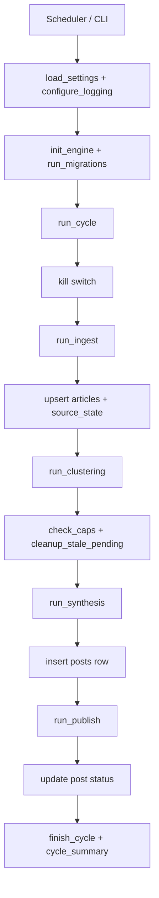

# tech-news-synth

Aplicação autônoma para coletar notícias de tecnologia, agrupar tópicos relacionados, sintetizar um post curto em PT-BR com Claude e publicar automaticamente no X para a conta `@ByteRelevant`.

O projeto roda como um worker agendado com APScheduler, persiste estado em PostgreSQL e foi desenhado para ser operado via Docker Compose, CLI e banco de dados. Não existe uma API HTTP interna para administração; o controle operacional acontece por comandos, arquivos de configuração, variáveis de ambiente, kill switch e funções de orquestração.

## Sumário

- [Visão geral](#visão-geral)
- [Arquitetura](#arquitetura)
- [Fluxo da aplicação](#fluxo-da-aplicação)
- [Funcionalidades](#funcionalidades)
- [Pontos de controle e gerenciamento](#pontos-de-controle-e-gerenciamento)
- [Endpoints](#endpoints)
- [Funções acionáveis](#funções-acionáveis)
- [Persistência e tabelas](#persistência-e-tabelas)
- [Configuração](#configuração)
- [Execução](#execução)
- [Operação diária](#operação-diária)
- [Scripts auxiliares](#scripts-auxiliares)
- [Testes](#testes)
- [Estrutura do código](#estrutura-do-código)

## Visão geral

Em cada ciclo, a aplicação:

1. carrega e valida configuração;
2. aplica migrações do banco;
3. coleta notícias de múltiplas fontes;
4. normaliza e deduplica artigos;
5. agrupa artigos por tema;
6. escolhe o melhor cluster ou um fallback;
7. gera um texto curto em PT-BR com hashtags controladas;
8. aplica limites de custo e de volume;
9. publica no X, ou registra `dry_run` quando configurado;
10. grava auditoria completa do ciclo no banco e nos logs.

## Arquitetura

### Stack real do projeto

| Componente | Tecnologia |
| --- | --- |
| Linguagem | Python 3.12 |
| Empacotamento | `uv` |
| Scheduler | APScheduler |
| Banco de dados | PostgreSQL 16 |
| ORM/migrações | SQLAlchemy 2 + Alembic |
| HTTP ingest | `httpx` + `tenacity` |
| Parsing RSS | `feedparser` |
| Limpeza HTML | BeautifulSoup + `lxml` |
| Clusterização | `scikit-learn` + `numpy` |
| Síntese | Anthropic SDK |
| Publicação no X | `tweepy` |
| Logs | `structlog` |
| Orquestração local | Docker Compose |

### Componentes internos

| Camada | Responsabilidade | Arquivos principais |
| --- | --- | --- |
| Entrypoint | Escolhe entre scheduler e CLIs | [`src/tech_news_synth/__main__.py`](/Users/jucassoli/development/git-repo/tech-news-synth/src/tech_news_synth/__main__.py) |
| Configuração | Carrega env vars e valida runtime | [`src/tech_news_synth/config.py`](/Users/jucassoli/development/git-repo/tech-news-synth/src/tech_news_synth/config.py) |
| Scheduler | Agenda ciclos e instala shutdown gracioso | [`src/tech_news_synth/scheduler.py`](/Users/jucassoli/development/git-repo/tech-news-synth/src/tech_news_synth/scheduler.py) |
| Ingestão | Busca e normaliza notícias | [`src/tech_news_synth/ingest/`](/Users/jucassoli/development/git-repo/tech-news-synth/src/tech_news_synth/ingest) |
| Clusterização | Agrupa artigos e evita repetição | [`src/tech_news_synth/cluster/`](/Users/jucassoli/development/git-repo/tech-news-synth/src/tech_news_synth/cluster) |
| Síntese | Monta prompt, chama Claude e formata post | [`src/tech_news_synth/synth/`](/Users/jucassoli/development/git-repo/tech-news-synth/src/tech_news_synth/synth) |
| Publicação | Aplica caps, publica no X e trata falhas | [`src/tech_news_synth/publish/`](/Users/jucassoli/development/git-repo/tech-news-synth/src/tech_news_synth/publish) |
| Persistência | Sessão, modelos e repositórios | [`src/tech_news_synth/db/`](/Users/jucassoli/development/git-repo/tech-news-synth/src/tech_news_synth/db) |
| Operação | CLIs e scripts smoke/soak | [`src/tech_news_synth/cli/`](/Users/jucassoli/development/git-repo/tech-news-synth/src/tech_news_synth/cli), [`scripts/`](/Users/jucassoli/development/git-repo/tech-news-synth/scripts) |

## Fluxo da aplicação



## Funcionalidades

| Funcionalidade | Descrição | Estado no código |
| --- | --- | --- |
| Agendamento automático | Executa ciclos em intervalo fixo configurável por `INTERVAL_HOURS` | Implementado |
| Primeiro ciclo ao subir | O scheduler dispara imediatamente no boot | Implementado |
| Coleta multi-fonte | RSS, Hacker News Firebase e Reddit JSON | Implementado |
| Retry HTTP | Retries em `429`, `5xx` e erros de transporte | Implementado |
| Conditional GET em RSS | Usa `ETag` e `Last-Modified` para economizar chamadas | Implementado |
| Normalização e deduplicação | Canonicaliza URL, limpa HTML e deduplica por hash | Implementado |
| Saúde das fontes | Mantém `source_state`, falhas consecutivas e auto-disable | Implementado |
| Clusterização temática | Agrupa artigos por similaridade e ranqueia candidatos | Implementado |
| Anti-repeat | Evita postar tema muito parecido com posts recentes | Implementado |
| Fallback de artigo único | Quando não há cluster válido, escolhe um artigo individual | Implementado |
| Síntese PT-BR | Gera texto curto via Anthropic | Implementado |
| Controle de hashtags | Hashtags vêm de allowlist YAML, não do LLM | Implementado |
| Controle de orçamento | Limite diário de posts e limite mensal de custo | Implementado |
| `dry_run` | Executa pipeline sem publicar no X | Implementado |
| Publicação idempotente | Guard rails contra reprocessamentos e estados órfãos | Implementado |
| Replay operacional | Reexecuta síntese de um ciclo passado sem criar post | Implementado |
| Gestão manual de fontes | Habilitar/desabilitar fonte via CLI | Implementado |
| Auditoria de ciclos | Grava `run_log`, `posts`, `clusters` e logs estruturados | Implementado |

## Pontos de controle e gerenciamento

### Controles operacionais

| Mecanismo | Como funciona | Efeito |
| --- | --- | --- |
| `PAUSED=1` | Variável de ambiente | Pausa todos os ciclos |
| Arquivo `PAUSED_MARKER_PATH` | Por padrão `/data/paused` | Pausa todos os ciclos |
| `DRY_RUN=1` | Variável de ambiente | Executa tudo, mas não posta no X |
| `python -m tech_news_synth post-now` | CLI one-shot | Força um ciclo fora da cadência |
| `python -m tech_news_synth replay --cycle-id ...` | CLI | Regera a síntese de um ciclo passado |
| `python -m tech_news_synth source-health` | CLI | Exibe saúde das fontes |
| `python -m tech_news_synth source-health --disable NOME` | CLI | Desabilita uma fonte |
| `python -m tech_news_synth source-health --enable NOME` | CLI | Reabilita uma fonte |
| `cleanup_stale_pending(...)` | Função de publish | Marca `pending` órfãos como `failed` |
| `check_caps(...)` | Função de publish | Impede síntese/publicação acima dos limites |

### Comandos disponíveis

| Comando | Finalidade | Saída principal |
| --- | --- | --- |
| `python -m tech_news_synth` | Sobe scheduler contínuo | Logs estruturados |
| `python -m tech_news_synth post-now` | Executa 1 ciclo imediato | Exit code e logs |
| `python -m tech_news_synth replay --cycle-id <ULID>` | Reprocessa síntese sem persistir `posts` | JSON em stdout |
| `python -m tech_news_synth source-health` | Mostra estado das fontes | Tabela texto |
| `python -m tech_news_synth source-health --json` | Estado das fontes em formato máquina | JSON em stdout |
| `python -m tech_news_synth source-health --disable <name>` | Desativa fonte manualmente | Exit code + log |
| `python -m tech_news_synth source-health --enable <name>` | Reativa fonte manualmente | Exit code + log |

## Endpoints

### API interna da aplicação

Esta aplicação não expõe endpoints HTTP REST ou GraphQL próprios.

O “controle” do sistema é feito por:

- CLI;
- banco de dados PostgreSQL;
- arquivos YAML;
- variáveis de ambiente;
- integrações com APIs externas.

### Endpoints externos consumidos

| Serviço | Endpoint/padrão | Uso no sistema | Origem no código |
| --- | --- | --- | --- |
| RSS | URL definida em `config/sources.yaml` | Buscar feeds RSS/Atom | [`src/tech_news_synth/ingest/fetchers/rss.py`](/Users/jucassoli/development/git-repo/tech-news-synth/src/tech_news_synth/ingest/fetchers/rss.py) |
| Hacker News | `{base}/topstories.json` | Lista IDs de top stories | [`src/tech_news_synth/ingest/fetchers/hn_firebase.py`](/Users/jucassoli/development/git-repo/tech-news-synth/src/tech_news_synth/ingest/fetchers/hn_firebase.py) |
| Hacker News | `{base}/item/{id}.json` | Busca detalhes de cada story | [`src/tech_news_synth/ingest/fetchers/hn_firebase.py`](/Users/jucassoli/development/git-repo/tech-news-synth/src/tech_news_synth/ingest/fetchers/hn_firebase.py) |
| Reddit | URL `.json` definida em `config/sources.yaml` | Busca posts do subreddit | [`src/tech_news_synth/ingest/fetchers/reddit_json.py`](/Users/jucassoli/development/git-repo/tech-news-synth/src/tech_news_synth/ingest/fetchers/reddit_json.py) |
| Anthropic | Chamadas via SDK `anthropic.Anthropic(...)` | Geração da síntese | [`src/tech_news_synth/synth/orchestrator.py`](/Users/jucassoli/development/git-repo/tech-news-synth/src/tech_news_synth/synth/orchestrator.py) |
| X API | `client.create_tweet(...)` via Tweepy | Publicação do post | [`src/tech_news_synth/publish/client.py`](/Users/jucassoli/development/git-repo/tech-news-synth/src/tech_news_synth/publish/client.py) |
| X API | `client.delete_tweet(...)` via script smoke | Validação operacional de post/delete | [`scripts/smoke_x_post.py`](/Users/jucassoli/development/git-repo/tech-news-synth/scripts/smoke_x_post.py) |

### Fontes padrão configuradas

| Nome | Tipo | URL |
| --- | --- | --- |
| `techcrunch` | `rss` | `https://techcrunch.com/feed/` |
| `verge` | `rss` | `https://www.theverge.com/rss/index.xml` |
| `ars_technica` | `rss` | `https://feeds.arstechnica.com/arstechnica/index` |
| `hacker_news` | `hn_firebase` | `https://hacker-news.firebaseio.com/v0` |
| `reddit_technology` | `reddit_json` | `https://www.reddit.com/r/technology/.json` |

## Funções acionáveis

As funções abaixo são os principais pontos programáticos de disparo, controle ou composição do sistema.

### Orquestração principal

| Função | Papel |
| --- | --- |
| `tech_news_synth.__main__.main(argv=None)` | Entrypoint geral do módulo |
| `tech_news_synth.__main__._dispatch_scheduler()` | Inicializa app para modo contínuo |
| `tech_news_synth.scheduler.run(settings, ...)` | Sobe o APScheduler |
| `tech_news_synth.scheduler.build_scheduler(settings, ...)` | Cria scheduler configurado |
| `tech_news_synth.scheduler.run_cycle(settings, ...)` | Executa um ciclo completo |

### Ingestão

| Função | Papel |
| --- | --- |
| `tech_news_synth.ingest.orchestrator.run_ingest(session, config, client, settings)` | Busca todas as fontes e persiste artigos |
| `tech_news_synth.ingest.http.build_http_client(...)` | Cria `httpx.Client` compartilhado do ciclo |
| `tech_news_synth.ingest.http.fetch_with_retry(...)` | Chamada HTTP com retry |
| `tech_news_synth.ingest.sources_config.load_sources_config(path)` | Carrega e valida `sources.yaml` |
| `tech_news_synth.ingest.fetchers.rss.fetch(...)` | Coleta feeds RSS |
| `tech_news_synth.ingest.fetchers.hn_firebase.fetch(...)` | Coleta Hacker News |
| `tech_news_synth.ingest.fetchers.reddit_json.fetch(...)` | Coleta Reddit JSON |

### Clusterização

| Função | Papel |
| --- | --- |
| `tech_news_synth.cluster.orchestrator.run_clustering(session, cycle_id, settings, sources_config)` | Forma clusters e escolhe vencedor/fallback |
| `tech_news_synth.cluster.antirepeat.check_antirepeat(...)` | Rejeita tema muito parecido com posts recentes |
| `tech_news_synth.cluster.fallback.pick_fallback(...)` | Seleciona fallback quando não há cluster vencedor |
| `tech_news_synth.cluster.rank.rank_candidates(...)` | Ranqueia clusters válidos |

### Síntese

| Função | Papel |
| --- | --- |
| `tech_news_synth.synth.orchestrator.run_synthesis(session, cycle_id, selection, settings, sources_config, anthropic_client, hashtag_allowlist, persist=True)` | Gera o texto final e opcionalmente persiste `posts` |
| `tech_news_synth.synth.hashtags.load_hashtag_allowlist(path)` | Carrega e valida `hashtags.yaml` |
| `tech_news_synth.synth.hashtags.select_hashtags(...)` | Seleciona hashtags a partir do cluster |
| `tech_news_synth.synth.prompt.build_system_prompt(...)` | Monta prompt de sistema |
| `tech_news_synth.synth.prompt.build_user_prompt(...)` | Monta prompt principal |
| `tech_news_synth.synth.client.call_haiku(...)` | Chama o modelo Anthropic |

### Publicação e guard rails

| Função | Papel |
| --- | --- |
| `tech_news_synth.publish.orchestrator.run_publish(session, cycle_id, synthesis_result, settings, x_client)` | Publica ou marca falha/dry-run |
| `tech_news_synth.publish.client.build_x_client(settings)` | Constrói cliente do X |
| `tech_news_synth.publish.client.post_tweet(client, text)` | Executa `create_tweet` com tratamento estruturado |
| `tech_news_synth.publish.caps.check_caps(session, settings)` | Verifica limites diários e mensais |
| `tech_news_synth.publish.idempotency.cleanup_stale_pending(session, cutoff_minutes)` | Limpa posts `pending` órfãos |

### Estado operacional e banco

| Função | Papel |
| --- | --- |
| `tech_news_synth.killswitch.is_paused(settings)` | Resolve pausa por env e/ou marker file |
| `tech_news_synth.db.migrations.run_migrations()` | Executa `alembic upgrade head` |
| `tech_news_synth.db.run_log.start_cycle(session, cycle_id)` | Cria `run_log` no início do ciclo |
| `tech_news_synth.db.run_log.finish_cycle(session, cycle_id, status, counts, notes)` | Finaliza `run_log` |
| `tech_news_synth.db.source_state.enable_source(session, name)` | Reabilita uma fonte |
| `tech_news_synth.db.source_state.disable_source(session, name)` | Desabilita uma fonte |
| `tech_news_synth.db.source_state.get_all_source_states(session)` | Lista estado das fontes |

### CLIs

| Função | Papel |
| --- | --- |
| `tech_news_synth.cli.post_now.main(argv)` | CLI para ciclo imediato |
| `tech_news_synth.cli.replay.main(argv)` | CLI para replay de síntese |
| `tech_news_synth.cli.source_health.main(argv)` | CLI de inspeção/gestão de fontes |

## Persistência e tabelas

| Tabela | Finalidade | Campos relevantes |
| --- | --- | --- |
| `run_log` | Auditoria de cada ciclo | `cycle_id`, `started_at`, `finished_at`, `status`, `counts`, `notes` |
| `articles` | Artigos normalizados e deduplicados | `source`, `url`, `canonical_url`, `title`, `summary`, `published_at`, `article_hash` |
| `clusters` | Clusters formados por ciclo | `cycle_id`, `member_article_ids`, `centroid_terms`, `chosen`, `coverage_score` |
| `posts` | Resultado da síntese/publicação | `cycle_id`, `cluster_id`, `status`, `tweet_id`, `cost_usd`, `synthesized_text`, `hashtags`, `error_detail` |
| `source_state` | Saúde e cache de cada fonte | `name`, `etag`, `last_modified`, `consecutive_failures`, `disabled_at`, `last_status` |

### Status importantes

| Entidade | Status |
| --- | --- |
| `run_log.status` | `running`, `ok`, `error` |
| `posts.status` | `pending`, `posted`, `failed`, `dry_run` |
| `source_state.last_status` | `ok`, `skipped_304`, `error:<tipo>` |

## Configuração

### Variáveis de ambiente principais

| Variável | Default | Descrição |
| --- | --- | --- |
| `INTERVAL_HOURS` | `2` | Intervalo do scheduler; deve dividir 24 |
| `PAUSED` | `0` | Pausa execução global |
| `DRY_RUN` | `0` | Roda sem publicar no X |
| `SOURCES_CONFIG_PATH` | `/app/config/sources.yaml` | Caminho do YAML de fontes |
| `HASHTAGS_CONFIG_PATH` | `/app/config/hashtags.yaml` | Caminho do YAML de hashtags |
| `MAX_CONSECUTIVE_FAILURES` | `20` | Threshold para auto-disable de fonte |
| `CLUSTER_WINDOW_HOURS` | `6` | Janela usada na clusterização |
| `ANTI_REPEAT_WINDOW_HOURS` | `48` | Janela de comparação com posts recentes |
| `SYNTHESIS_CHAR_BUDGET` | `225` | Orçamento de caracteres para corpo do texto |
| `MAX_POSTS_PER_DAY` | `12` | Limite diário de posts |
| `MAX_MONTHLY_COST_USD` | `30.00` | Limite mensal de custo |
| `PUBLISH_STALE_PENDING_MINUTES` | `5` | Idade para considerar `pending` órfão |
| `X_API_TIMEOUT_SEC` | `30` | Timeout do cliente do X |

### Arquivos de configuração

| Arquivo | Papel |
| --- | --- |
| [`config/sources.yaml`](/Users/jucassoli/development/git-repo/tech-news-synth/config/sources.yaml) | Fontes de ingestão e pesos |
| [`config/sources.yaml.example`](/Users/jucassoli/development/git-repo/tech-news-synth/config/sources.yaml.example) | Exemplo mínimo de config |
| [`config/hashtags.yaml`](/Users/jucassoli/development/git-repo/tech-news-synth/config/hashtags.yaml) | Allowlist de hashtags |
| [`.env.example`](/Users/jucassoli/development/git-repo/tech-news-synth/.env.example) | Exemplo de env vars |
| [`compose.yaml`](/Users/jucassoli/development/git-repo/tech-news-synth/compose.yaml) | Stack Docker Compose |

## Execução

### Local com Docker Compose

```bash
cp .env.example .env
docker compose up -d --build
docker compose logs -f app
```

### Execução do módulo

```bash
python -m tech_news_synth
```

### Rodar um ciclo manual

```bash
python -m tech_news_synth post-now
```

### Replay de um ciclo

```bash
python -m tech_news_synth replay --cycle-id 01K...
```

### Consultar saúde das fontes

```bash
python -m tech_news_synth source-health
python -m tech_news_synth source-health --json
python -m tech_news_synth source-health --disable reddit_technology
python -m tech_news_synth source-health --enable reddit_technology
```

## Operação diária

### Pausar a aplicação

Opção 1, por env:

```bash
PAUSED=1
```

Opção 2, por marker file:

```bash
touch /data/paused
```

### Retomar a aplicação

```bash
rm -f /data/paused
```

ou removendo `PAUSED=1`.

### O que observar em produção

- evento `scheduler_starting` no boot;
- evento `cycle_start` a cada intervalo;
- evento `cycle_summary` após cada ciclo não pausado;
- tabela `source_state` para fontes falhando ou desabilitadas;
- tabela `posts` para verificar `pending`, `posted`, `failed` e `dry_run`;
- tabela `run_log` para auditoria consolidada.

### Saída operacional importante

O campo `run_log.counts` consolida métricas do ciclo, incluindo:

- artigos buscados por fonte;
- quantidade de artigos inseridos;
- quantidade de clusters;
- `chosen_cluster_id`;
- `fallback_article_id`;
- tokens e custo de síntese;
- status final de publicação;
- id do tweet quando houver.

## Scripts auxiliares

| Script | Finalidade |
| --- | --- |
| [`scripts/smoke_anthropic.py`](/Users/jucassoli/development/git-repo/tech-news-synth/scripts/smoke_anthropic.py) | Smoke test de acesso à Anthropic |
| [`scripts/smoke_x_auth.py`](/Users/jucassoli/development/git-repo/tech-news-synth/scripts/smoke_x_auth.py) | Valida autenticação no X |
| [`scripts/smoke_x_post.py`](/Users/jucassoli/development/git-repo/tech-news-synth/scripts/smoke_x_post.py) | Posta e apaga um tweet real de teste |
| [`scripts/soak_monitor.py`](/Users/jucassoli/development/git-repo/tech-news-synth/scripts/soak_monitor.py) | Monitora soak de 48h em `dry_run` |
| [`scripts/create_test_db.sh`](/Users/jucassoli/development/git-repo/tech-news-synth/scripts/create_test_db.sh) | Apoio para banco de testes |
| [`scripts/cutover_verify.py`](/Users/jucassoli/development/git-repo/tech-news-synth/scripts/cutover_verify.py) | Verificação de cutover |

## Testes

O repositório possui cobertura de testes unitários e de integração em [`tests/`](/Users/jucassoli/development/git-repo/tech-news-synth/tests), cobrindo:

- carregamento de configuração;
- fetchers e retry HTTP;
- normalização e hashing;
- clusterização e determinismo;
- anti-repeat;
- síntese, truncamento e orçamento;
- publicação, rate limit e idempotência;
- CLIs operacionais;
- migrações;
- soak monitor e run log.

Execução típica:

```bash
pytest
```

## Estrutura do código

```text
src/tech_news_synth/
  __main__.py          # Entrypoint e dispatch de CLI
  config.py            # Settings pydantic
  scheduler.py         # Scheduler e ciclo principal
  killswitch.py        # Pausa por env/arquivo
  ingest/              # Fetchers, HTTP, normalização, config
  cluster/             # Vetorização, ranking, fallback, anti-repeat
  synth/               # Prompt, cliente Anthropic, hashtags, truncamento
  publish/             # Cliente X, caps, idempotência, publish
  db/                  # Sessão, modelos, migrações, repositórios
  cli/                 # post-now, replay, source-health
```

## Referências operacionais

- Runbook de deploy: [`docs/DEPLOY.md`](/Users/jucassoli/development/git-repo/tech-news-synth/docs/DEPLOY.md)
- Runbook de `pending` órfão: [`docs/runbook-orphaned-pending.md`](/Users/jucassoli/development/git-repo/tech-news-synth/docs/runbook-orphaned-pending.md)

